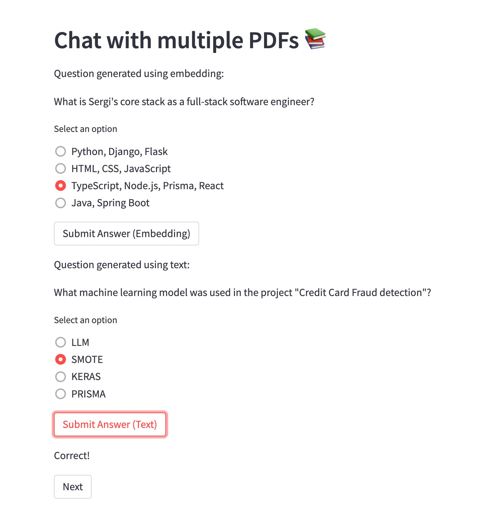

# Project Documentation: Multi-PDF Interactive QA Generator

## Overview

This project enables users to upload multiple PDF documents and generate interactive multiple-choice questions (MCQs) based on their content. The system employs two methods for generating questions:
1. Using a native LLM (Large Language Model) based on its general training data.
2. Using embedding-based contextualization with a vector database to provide more relevant questions based solely on the uploaded PDFs.

---

## Key Features

- **PDF Text Extraction**: Extracts text from multiple uploaded PDFs.
- **Text Splitting**: Processes text into manageable chunks for efficient processing.
- **Dual Question Generation**: 
  - Text-based LLM generation.
  - Embedding-enhanced contextual generation.
- **Interactive QA**: Users answer MCQs and receive instant feedback.

---

## Technology Stack

### Libraries and Frameworks
- **Streamlit**: Provides a user-friendly interface for interaction.
- **PyPDF2**: Extracts text from PDF documents.
- **LangChain**: Manages LLM interactions and embeddings.
- **FAISS**: Efficient vector similarity search for embedding-based contextualization.
- **OpenAI API**: Provides LLM capabilities.
- **HuggingFace Transformers**: (Optional) For embeddings, though noted to be slower.

### Why These Technologies?
- **Streamlit**: Rapid development of interactive web apps.
- **FAISS**: High-performance similarity search, crucial for handling embedding vectors.
- **LangChain**: Simplifies the integration of multiple LLMs and embeddings.
- **OpenAI and HuggingFace**: Support robust LLMs and embedding models, enabling diverse question-generation techniques.

---

## Workflow

### 1. Upload and Process PDFs
- **Text Extraction**: Text is extracted using PyPDF2.
- **Text Chunking**: TextSplitter divides large text into smaller chunks for efficient embedding and processing.

### 2. Embedding-Based Contextualization
- **Embedding Model**: Uses HuggingFaceInstructEmbeddings (slow but precise) or OpenAIEmbeddings (faster but paid alternative).
- **Vectorstore Creation**: Builds a FAISS index for similarity searches among text chunks.
- **Caching**: Saves the FAISS index for static testing scenarios to save money and time.

### 3. Question Generation
- **LLM-Based Text Generation**:
  - Directly uses text chunks to prompt the LLM for MCQ generation.
  - Results in general questions based on the LLM's training data.
- **Embedding-Enhanced Generation**:
  - Uses FAISS to retrieve similar text chunks for contextual prompts.
  - Produces more relevant questions tailored to the uploaded PDFs.

---

## Known Challenges

### **1. Slow Embedding with HuggingFaceInstructEmbeddings**
- The HuggingFace embedding model is precise but has significant latency especially when loading the underlining embedding.
- Currently: Use OpenAIEmbeddings _(which is paid)_ for a faster workflow unless high precision is needed.

### **2. Disparity in Generated Questions**
- **Text-Based Questions**: Tend to be generic, leveraging the LLM's pretrained knowledge.
- **Embedding-Based Questions**: Contextually relevant, leveraging the content of uploaded PDFs.

**Example**: 

For a portfolio PDF uploaded by Sergi:
- **Embedding-Based Question**: *"What is Sergi's core stack as a full-stack software engineer?"*
  - Options include specific skills from the document.
- **Text-Based Question**: *"What machine learning model was used in the project 'Credit Card Fraud detection'?"*
  - Options are general and may not relate to the uploaded PDF.

---

## Future Improvements

1. **Optimize Embedding Workflow**:
   - Explore lighter embedding models for reduced latency.
   - Implement batch processing for embedding generation.

2. **Evaluation of Generated Questions**:
    - Implement metrics to assess the quality of the generated multiple-choice questions. These could include:
        - Relevance: Measure how well the questions align with the original text chunk.
        - Coherence: Evaluate whether the questions and answer choices make logical sense and are clearly worded.
        - Difficulty: Use NLP techniques to gauge the complexity of the questions, ensuring a balance between easy, medium, and hard questions.
        - Diversity: Ensure a variety of question types (e.g., fact-based, conceptual, application-based).
        - Accuracy: Automatically check if the correct answer is indeed correct by cross-referencing with the text or using fact-checking models.
